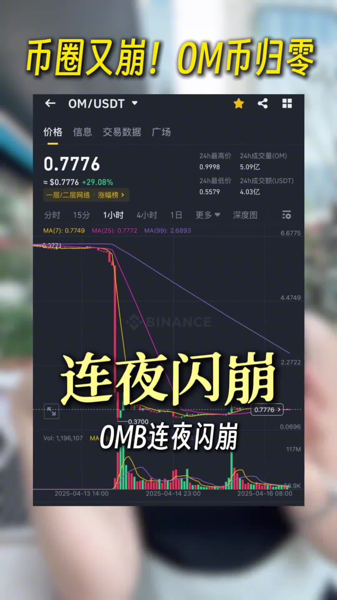

# 幣圈OMB崩盤事件分析：風險與警示

## 第一部分：事件經過原文呈現

### 崩盤事件概述

幣圈又崩了，昨天凌晨被稱為和歸風向標的OMB連夜閃崩，價格從6美元直接暴跌到5毛錢，單日暴跌超過了90%，整個是連夜蒸發了55億美元，而合約玩家也是血流成河，暴倉虧了50%美元。

### 交易所與項目方回應

但是項目方卻虔誠說這事合我無關，可能是交易所的問題或者是市場操控，總之與我無關。而這個幣圈市場很多交易大所的交易所那邊也是不承認，第一大所幣安CZ也專門發了一條推，似乎就在回應這件事情。翻譯過來他就是說：「不要追逐虛勢，要關注基本面，最重要的是安全」，似乎也是想表達交易所只提供商幣服務，至於交易是否安全完全由用戶自己來決定。

到底是交易所在搞鬼還是項目方自己買的雷呢？我去鏈上扒了一下。

### 代幣發行與持有情況分析

這個幣一共發行了9億多枚，而項目團隊和它的關聯地址持有了將近8億枚，占總供應量的90%，真正在市場上流通的代幣不超過8800萬枚，僅占2%。這種驚人的持倉集中度，如果不是莊家操控的話，我覺得世界上也就沒有什麼莊家了。

這個幣最早四年前就開始上線，從兩分錢開始，劃冰獎故事最高翻過500倍，到達過9塊錢，衝進過全球市值的前20名。

### 警示與結論

而實際上放了多少實際業務，估計只有莊家自己心裡最清楚了。韭菜們現在就不要再想著什麼抄底了，莊家早就吃飽喝足，搞個倒糖瓶了。畢竟幣圈離奇的故事真是太多太多了，數不勝數。

老韭菜們應該還記得幾年前穩定幣Luna的那個死亡螺旋，穩定幣也是會歸零崩盤的。還有「爆炸頭」的爆雷教育，所以沒有什麼是真正的安全。

而OMB這一波的歸零，表面上看好像是流動性危機，而背地裡很有可能是一場早有預謀的高度控盤和跨平台的收割遊戲。莊家的劇本早都已經寫好了，留給韭菜們的都是無盡被收割的寫好的劇本。所以如果沒有腦子和穩健的底倉，那麼「幣背起飛」都屬於別人，「讀狗歸零」才屬於自己。希望大家都能夠平穩上路。

那下一個歸零你覺得是誰呢？來評論區集合了，關注老姐高彈講解。

---

## 第二部分：深度分析與延伸探討

### Mantra（OMB/OM）項目背景

Mantra，前身為Mantra DAO，成立於2020年10月，最初建立在基於Parity Substrate的RioChain上，這是為Polkadot生態系統設計的。該項目的願景是為web 3.0創建一個社區治理、透明且去中心化的生態系統。

其聯合創始人兼CEO John Patrick Mullin熱衷於服務傳統金融（TradFi）參與者進入代幣化空間，並利用真實世界資產（RWAs）的潛力。OM是Mantra生態系統的原生代幣，具有多種用途：

1. **網絡安全**：MANTRA L1區塊鏈採用權益證明（PoS）機制，使用OM代幣保護網絡安全。驗證者和委託者都可以參與質押並獲得獎勵。
2. **交易費用**：每次在Guard Module中鑄造或銷毀新代幣時，都會向協議庫支付費用。
3. **CosmWasm整合**：支持智能合約功能。
4. **治理**：社區可以通過DAO（去中心化自治組織）結構參與項目治理。

### 崩盤事件深層分析

根據市場報導，OMB（也稱為OM）代幣在2025年4月13日經歷了災難性的價格崩盤。在UTC時間晚間的低流動性時段，價格從6.70美元暴跌至僅0.37美元，跌幅達93%，市值蒸發約55億美元。

#### 崩盤的可能原因：

1. **持倉高度集中**：如視頻中所述，項目方及關聯地址持有總供應量的90%，市場流通量僅為2%，這種高度集中的持倉結構使得價格極易被操控。

2. **中心化交易所的強制平倉**：Mantra團隊聲稱崩盤是由於中心化交易所在低流動性時段的「魯莽強制平倉」導致的連鎖反應，觸發了大規模清算。

3. **代幣經濟學變更**：報導顯示，自2024年10月以來，OMB的代幣經濟學發生了重大變化。幣安甚至從2025年1月起在OMB的現貨交易頁面上發出彈出警告，提醒用戶關注代幣供應量和代幣經濟學的重大變化。

4. **市場操控**：如視頻分析所指出的，在少數地址控制大部分供應量的情況下，存在高度市場操控的可能性。這種「拉高出貨」或「抽水拋售」的模式在加密貨幣市場尤為常見。

### 加密貨幣市場操控的常見模式

加密貨幣市場由於缺乏監管和透明度，常見多種市場操控手法：

1. **閃崩與流動性操縱**：研究表明，加密貨幣的閃崩並非隨機發生，而是通常通過高頻交易策略、過度槓桿和「止損獵殺」戰術精心策劃的。比特幣的流動性危機進一步因為極端槓桿而加劇，使其成為市場操控的理想目標。

2. **抽水拋售**：大型投資者相互協調，抬高加密貨幣價格，然後在高位獲利了結，導致幣價崩盤。

3. **中心化交易所的角色**：中心化交易所在這一危機中扮演著關鍵角色。儘管它們主導了全球加密市場，但大多數交易所對平台上發生的操控行為幾乎沒有採取任何措施。其動機很明顯：上市費和交易量利潤豐厚，而交易所從操控發行所產生的波動性和炒作中受益。

### Luna與OMB崩盤的比較

視頻中提到了穩定幣Luna的「死亡螺旋」事件作為參考案例。2022年5月，Terra Luna生態系統崩潰，其穩定幣UST脫鉤，導致Luna代幣幾乎歸零，市值從近300億美元蒸發。

**相似之處**：
- 兩者都經歷了極端的單日價格下跌（>90%）
- 都涉及市場流動性問題
- 都引發了更廣泛的加密貨幣市場動盪

**不同之處**：
- Luna涉及算法穩定幣機制失效
- OMB崩盤更多與持倉集中度和可能的市場操控有關

### 對投資者的建議

1. **避免追逐高風險資產**：如視頻和幣安CZ所強調的，投資者應該關注項目的基本面而非短期價格波動。

2. **注意代幣分配和流通情況**：高度集中的持倉結構是一個危險信號，表明項目可能存在操控風險。

3. **建立穩健的投資策略**：如視頻所說，「如果沒有腦子和穩健的底倉，那麼幣背起飛都屬於別人，讀狗歸零才屬於自己」。

4. **警惕市場操控**：加密貨幣市場缺乏監管，投資者應該對異常的價格行為和市場模式保持警惕。

5. **理解流動性風險**：低流動性可能導致極端價格波動，尤其是在槓桿交易的情況下。

### 結論

OMB/OM幣的崩盤事件是對加密貨幣市場固有風險的鮮明提醒。雖然區塊鏈技術和代幣化資產有著革命性的潛力，但缺乏監管、透明度不足以及市場操控等問題仍然威脅著市場的健康發展。

這一事件再次證明，在加密貨幣市場，投資者需要謹慎行事，進行徹底的盡職調查，並且對「太好而不真實」的回報持懷疑態度。正如視頻所提醒的，加密貨幣市場中離奇的故事數不勝數，而「莊家的劇本早已寫好」，留給普通投資者的可能僅僅是「無盡被收割的寫好的劇本」。

在這個不斷演變的金融領域，教育、風險管理和健康的懷疑精神才是投資者的最佳保護。